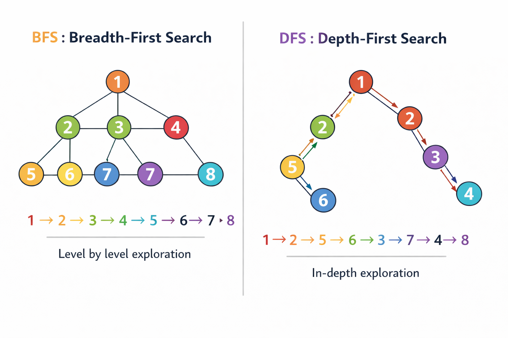

*This project has been created as part of the 42 curriculum by ldemaill, qgairaud.*

Thank you ldemaill for your generosity and sense of humor. You managed to brighten our labyrinthine wanderings with your good mood. Keep it up, great mate!

Here is ldemaill personal GitHub, where you can find more about him and discover some of his outstanding projects: https://github.com/loicdemailly-source

# A_maze_ing

<p align="center">
  
</p>

## 🎯 _Description_

The goal of this project is to build, in Python, a program capable of generating a maze of variable size along with its solution.

The maze is generated using parameters defined in a configuration file (`.txt`), including:

| Key         | Description                   | Example                   |
|:------------|:------------------------------|:--------------------------|
| WIDTH       | Maze width (number of cells)  | WIDTH=20                  |
| HEIGHT      | Maze eight                    | HEIGHT=15                 |
| ENTRY       | Entry coordinates(x,y)        | ENTRY=0,0                 |
| EXIT        | Entry coordinates(x,y)        | EXIT=19,14                |
| OUTPUT_FILE | Output filename               | OUTPUT_FILE=maze.txt      |
| PERFECT     | Is the maze perfect?          | PERFECT=True              |

SEED is an optional integer parameter that allows reproducible maze generation.

In this project, SEED must be an integer value for consistency and predictable reproducibility.

To preserve readability in terminal rendering, maze dimensions are intentionally limited (e.g., width ≤ 60).

<details>
<summary> 📝 Default example </summary>
<br/>
Here is an example of valid configuration you can copy/paste inside your config file:
<br/>

```
  WIDTH=25  
  HEIGHT=25  
  ENTRY=22,7  
  EXIT=2,19  
  OUTPUT_FILE=maze.txt  
  PERFECT=False  
```
</details>

The program provides several interactive options for displaying the maze and its solution directly in the terminal.

<details>
<summary> 📊  Generation </summary>
<br/>

The program starts by checking for the existence of a configuration file `config.txt`, provided as an argument and containing the parameters mentioned earlier.
If the configuration file does not exist, it uses values stored in another file, `default.txt`.

The program converts the data into a dictionary, and if the data is valid _(correct formats, all required parameters defined, distinct entry and exit points, no duplicates, etc.)_, it passes them to the `MazeGenerator` class.

From there, the generator creates a grid with the given dimensions, determines the entry and exit cells, and inserts the 42 logo at the center if the maze is large enough.
If the entry, the exit, or both would conflict with the central logo, the program stops with an explanatory error message.

Otherwise, the maze is generated using a first algorithm of the DFS type, `generate_maze_dfs`, which ensures that at least one wall is opened for each cell in the grid.
If the configuration parameter Perfect=False, the algorithm removes additional walls to allow multiple solutions later in the program.

Then, the program calls a second algorithm, this time of the BFS type, `solver_bfs`, which traverses the generated grid again from the entry cell to the exit cell, recording the most efficient path between the two points.

In addition to solving the maze, this allows the creation _(or overwriting)_ of a `maze.txt` file containing a hexadecimal representation of the maze _(the position and openness of each cell)_, as well as the entry and exit coordinates, and the maze solution expressed as a sequence of cardinal directions.

</details>


## 📖 _Instructions_

A Makefile is provided to simplify project usage.

Available commands:

- `make install`  
  Creates a virtual environment and installs required dependencies.

- `make run`  
  Runs the program using the configuration file.

- `make debug`  
  Runs the program using Python’s debugger (`pdb`).

- `make clean`  
  Removes cache files (`__pycache__`, `.mypy_cache`, `.pytest_cache`).

- `make fclean`  
  Removes cache files and virtual environment.

- `make lint`  
  Runs `flake8` and `mypy` with standard checks.

- `make lint-strict`  
  Runs stricter static analysis checks.

- `make re`  
  Cleans and runs the project again.

- `make test`  
  Use pytest to execute some basic tests ranged inside the given `tests` repository.

- `make build`
  Build the reusable `mazegen` package _(.whl and .tar.gz)_

## 📁 _Algorithms_

The main part of this project _(maze generation and solving)_ relies on two tree traversal algorithms explained below. They ensure efficiency and reproducibility regardless of the input data provided by the user.

<p align="center">
  
</p>

### Depth-First Search (DFS)

The maze generation is based on a DFS algorithm:

- Starting from the entry point
- Randomly exploring neighboring cells
- Removing walls between cells
- Backtracking when reaching dead ends

This approach ensures that every cell is reachable and the maze is fully connected


### Breadth-First Search (BFS)

The maze solving uses a BFS algorithm:

- Exploring all possible paths simultaneously
- Finding the shortest path from entry to exit
- Storing parent relationships to reconstruct the path afterward

## Reusable module: `mazegen`

<details>
<summary> 🔗 Click here </summary>
<br/>

The project includes a reusable Python module named `mazegen`, which contains the core maze generation logic.

This module is packaged using Python's standard build system and can be installed independently.

### Build the package

To build the package, execute this command 

```bash
make build
```

This will generate distribution files in the `dist/` directory:
- `.whl` (wheel package)
- `.tar.gz` (source distribution)

### Basic usage

```python
from mazegen import MazeGenerator

maze = MazeGenerator(
    width=20,
    height=15,
    entry=(0, 0),
    exit=(19, 14),
    perfect=True,
    seed=42
)

maze.generate()

path = maze.solve()
grid = maze.get_maze()
```

### Parameters

* `width` (int): Width of the maze
* `height` (int): Height of the maze
* `entry` (tuple[int, int]): Entry coordinates
* `exit` (tuple[int, int]): Exit coordinates
* `perfect` (bool): If `True`, generates a perfect maze (single solution)
* `seed` (Optional[int]): Allows reproducible maze generation

### Accessing results

* `maze.get_maze()` → returns the internal maze structure
* `maze.solve()` → returns the shortest path from entry to exit
* `maze.path_to_directions(path)` → converts a path into directions (`N`, `E`, `S`, `W`)

### Notes

* The module is independent from the main program (no UI, no file output).
* It is designed to be reusable in other Python projects.
* The internal maze representation may differ from the exported hexadecimal format used in the main application.
</details>


## 🛠️ _Task Distribution_

This project was developed by a two-person team:

**ldemaill** worked on parsing, typing, error handling, and the user interface

**qgairaud** implemented the BFS/DFS algorithms, the Makefile, the reusable module, and the README

Beyond our appreciation for simplicity and our desire to embrace it as a philosophy, we believe this project suffered from its placement within the pacing of the new curriculum. As complete beginners in programming, it became clear to us that this project could only be reasonably completed toward the end of Milestone 2, after having explored and validated most of the concepts introduced during the Python OOP piscine.

As a result, although we were eager to experiment with more ambitious approaches such as graphical rendering beyond the terminal, animation processes, or even a 3D adaptation, we chose not to let the appeal and richness of these features come at the expense of our overall learning progress.


## 🧟 _Resources_

About Graph traversal concepts (BFS & DFS):
- https://www.geeksforgeeks.org/dsa/dsa/
- https://www.jesuisundev.com/comprendre-les-algorithmes-de-parcours-en-8-minutes/
- https://zestedesavoir.com/tutoriels/681/a-la-decouverte-des-algorithmes-de-graphe/727_bases-de-la-theorie-des-graphes/3353_parcourir-un-graphe/

About Python resources and good practices:
- https://realpython.com/search?kind=article&kind=course&order=newest
- https://www.w3schools.com/python/default.asp

About Makefile in Python, pytest, build and pdb:
- https://gist.github.com/MarkWarneke/2e26d7caef237042e9374ebf564517ad
- https://docs.pytest.org/en/stable/
- https://docs.python.org/3/library/pdb.html
- https://pypi.org/project/build/

Finally, AI tools _(ChatGPT, Gemini)_ were used to understand graph traversal concepts, improve English phrasing and code structure, and test viability.